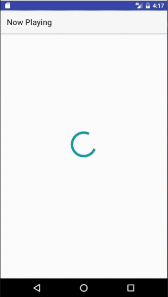

# MVP Example
This app is nothing more than an example of how to create a MVP (Model View Presenter) application.

MVP breaks down an application into more testable components keeping your internal business objects and data separate from
the external UI or external data.

The app simply loads a list of "Now Playing" movies based on [The Movie Database API](https://developers.themoviedb.org/3/movies/get-now-playing).

The requirements for the app:
1. As a user, show a list of "Now Playing" movies. Poster, Title, Release Date, & Rating. 
2. As a user, any rating at eight or above should be stared.
3. As a user, I only want to see ratings rounded to the nearest whole digit. 
4. As a user, while scrolling, keep loading "Now Playing" movies until you hit the last page. 

The application architecture is as followed: 

Note - the application packages are TYPE defined for ease of learning.

## Usage

Apache License 2.0. Free to use & distribute.

### Documentation

Please review all documentation in **docs/**. The following summaries describe their purpose:

| Name                                                                                          | Summary                                                     |
| :--------------------------------------------------------------------------------------------:|:------------------------------------------------------------|
| [AUTHORS.md](https://github.com/HIFILEO/MVPExample/blob/master/docs/AUTHORS.md)               | History of past and present contributors                    |
| [BUILDS.md](https://github.com/HIFILEO/MVPExample/blob/master/docs/BUILDS.md)                 | Description of official builds                              |
| [DEPENDENCIES.md](https://github.com/HIFILEO/MVPExample/blob/master/docs/DEPENDENCIES.md)     | How to generate a list of all major third party dependencies|
| [STYLE.md](https://github.com/HIFILEO/MVPExample/blob/master/docs/STYLE.md)                   | Description of Code Style and Static Analysis tools         |

### Build Flavors

Only the original build flavors release / debug. Use Debug since this
not an app for the google play store.

### Tests

This project supports the following type of tests:

1. Java Unit Test
2. Robolectric(There are none - and that was intentional to show how you can test without this when you use MVP)
3. Contract Test (Testing API end point / Restful API contracts)
4. Espresso UI Test (Written from engineering perspective)

To run all unit tests:

./gradlew testDebugUnitTest

To run all contract tests:

./gradlew contractTest '-Pcontract=true'

To run all espresso tests:

./gradlew connectedDebugAndroidTest

### Standards

There are style standards in this app as examples of how to maintain clean code.

#### Checkstyle

Ro run all checkstyle:
./gradlew checkstyle